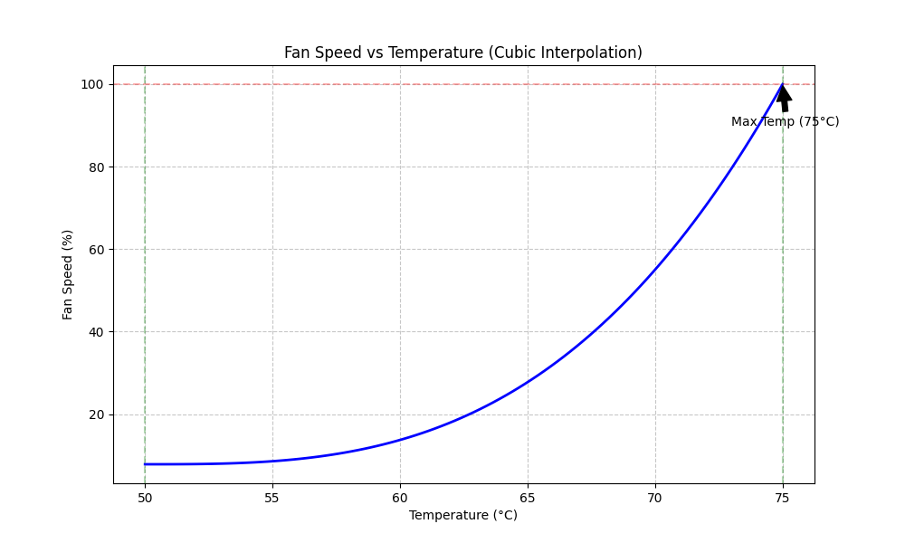

# Fan Control System

A Linux-based fan control system for NCT6798-based motherboards that provides temperature-based fan speed control a non-linear response curve.

## Overview

This system monitors CPU temperature and adjusts fan speeds using a cubic interpolation curve. The fan speed increases gradually at lower temperatures and more aggressively at higher temperatures, providing a balance between noise and cooling performance.

### Temperature-Fan Speed Curve



The curve shows how fan speed varies with temperature:
- Below 50°C: Fan speed stays at minimum (8% PWM)
- 50°C to 75°C: Fan speed increases following a cubic curve
- Above 75°C: Fan speed maxes out at 100% PWM

## How It Works

The fan speed is calculated using a cubic easing function between tempMin and tempMax. This creates a non-linear response that ramps up fan speed more aggressively as temperature increases:

$$
\text{fanSpeed} = \text{fanMin} + \frac{(\text{temp} - \text{tempMin})^3 \times (\text{fanMax} - \text{fanMin})}{(\text{tempMax} - \text{tempMin})^3}
$$

This formula provides:
- Very gentle increases at lower temperatures
- More aggressive increases at higher temperatures
- Smooth transitions throughout the temperature range

## Configuration

The system uses the following default parameters:
- `TEMP_MIN`: 50°C - Temperature at which fan speed starts increasing
- `TEMP_MAX`: 75°C - Temperature at which fan speed reaches maximum
- `FAN_MIN`: 20 (≈8% PWM) - Minimum fan speed
- `FAN_MAX`: 255 (100% PWM) - Maximum fan speed

## Configuration File

The system uses a configuration file located at `/etc/fan-control.conf`. This file is automatically created with default values when you first run the script. You can modify these values to customize the fan control behavior.

### Default Configuration

The configuration file includes the following settings:

```ini
# Temperature thresholds (in °C)
TEMP_MIN=50
TEMP_MAX=75

# Fan speed limits (0-255)
FAN_MIN=25
FAN_MAX=255

# Check interval (in seconds)
CHECK_INTERVAL=5

# Temperature hysteresis (in °C)
TEMP_HYST=1

# CSV logging configuration
CSV_DIR="/var/log"
CSV_DELIMITER=","

# Fan paths (only for connected fans)
FAN1_PWM="/sys/class/hwmon/hwmon3/pwm1"
FAN2_PWM="/sys/class/hwmon/hwmon3/pwm2"
FAN4_PWM="/sys/class/hwmon/hwmon3/pwm4"

# PWM mode paths
FAN1_MODE="/sys/class/hwmon/hwmon3/pwm1_mode"
FAN2_MODE="/sys/class/hwmon/hwmon3/pwm2_mode"
FAN4_MODE="/sys/class/hwmon/hwmon3/pwm4_mode"

# PWM enable paths
FAN1_ENABLE="/sys/class/hwmon/hwmon3/pwm1_enable"
FAN2_ENABLE="/sys/class/hwmon/hwmon3/pwm2_enable"
FAN4_ENABLE="/sys/class/hwmon/hwmon3/pwm4_enable"

# Temperature sensor paths
CPU_TEMP="/sys/class/hwmon/hwmon3/temp2_input"  # CPUTIN
SYS_TEMP="/sys/class/hwmon/hwmon3/temp1_input"  # SYSTIN
PECI_TEMP="/sys/class/hwmon/hwmon3/temp8_input" # PECI Agent 0
```

### Customizing the Configuration

You can modify the configuration file directly:

```bash
sudo nano /etc/fan-control.conf
```

Or use command-line options to override specific settings:

```bash
# Set custom temperature thresholds
--min-temp 45 --max-temp 80

# Set custom fan speed limits
--min-speed 10 --max-speed 100

# Set custom check interval
--interval 10

# Set custom CSV log directory
--csv-dir /path/to/logs
```

Note: If you modify the hardware paths (fan and temperature sensor paths), make sure they match your system's configuration. You can find the correct paths by checking the available hwmon devices:

```bash
ls -l /sys/class/hwmon/
```

## Installation

1. Copy the `fan-control.sh` script to your system:
   ```bash
   sudo cp fan-control.sh /usr/local/bin/fan-control
   ```

2. Make it executable:
   ```bash
   sudo chmod +x /usr/local/bin/fan-control
   ```

3. Create a systemd service file:
   ```bash
   sudo nano /etc/systemd/system/fan-control.service
   ```

4. Add the following content to the service file:
   ```ini
   [Unit]
   Description=Fan Control Service
   After=multi-user.target

   [Service]
   Type=simple
   ExecStart=/usr/local/bin/fan-control
   Restart=always
   RestartSec=5

   [Install]
   WantedBy=multi-user.target
   ```

5. Enable and start the service:
   ```bash
   sudo systemctl daemon-reload
   sudo systemctl enable fan-control.service
   sudo systemctl start fan-control.service
   ```

6. Verify the service is running:
   ```bash
   sudo systemctl status fan-control.service
   ```

## Convenient Monitoring

For easier monitoring of your system's fan and temperature status, you can add these aliases to your `~/.bash_aliases` file:

```bash
# Quick status check of PWM values and main temperatures
alias fan-control-status='echo "Fan Speeds:"; for fan in 1 2 4; do echo "Fan $fan: $(cat /sys/class/hwmon/hwmon4/pwm${fan})"; done; echo -e "\nTemperatures:"; echo "CPU: $(($(cat /sys/class/hwmon/hwmon4/temp2_input)/1000))°C"; echo "System: $(($(cat /sys/class/hwmon/hwmon4/temp1_input)/1000))°C"'

# Detailed fan speed information
alias fan-control-speeds='echo "Current Fan Speeds:"; for i in {1..7}; do label=$(cat /sys/class/hwmon/hwmon4/fan${i}_label 2>/dev/null); speed=$(cat /sys/class/hwmon/hwmon4/fan${i}_input 2>/dev/null); if [ ! -z "$speed" ]; then if [ ! -z "$label" ]; then echo "Fan $i ($label): $speed RPM"; else echo "Fan $i: $speed RPM"; fi; else echo "Fan $i: N/A"; fi; done'

# Detailed temperature information
alias fan-control-temperatures='echo "Temperature Sensors:"; for i in {1..7}; do echo -n "Temp $i ($(cat /sys/class/hwmon/hwmon4/temp${i}_label 2>/dev/null || echo "Unknown")): "; temp=$(cat /sys/class/hwmon/hwmon4/temp${i}_input 2>/dev/null); if [ ! -z "$temp" ]; then echo "$(echo "scale=1; $temp/1000" | bc)°C"; else echo "N/A"; fi; done'
```

After adding these aliases:
1. Save the file
2. Reload your aliases:
   ```bash
   source ~/.bash_aliases
   ```

Now you can use these convenient commands:
- `fan-control-status`: Quick overview of PWM values and main temperatures
- `fan-control-speeds`: Detailed fan speed information for all fans
- `fan-control-temperatures`: Detailed temperature information for all sensors

## Monitoring

The service logs its activity to the system journal. You can monitor the logs using:

```bash
# View all logs from the fan control service
journalctl -u fan-control.service

# Follow the logs in real-time
journalctl -u fan-control.service -f

# View logs from the last hour
journalctl -u fan-control.service --since "1 hour ago"

# View logs with timestamps
journalctl -u fan-control.service -o short-precise
```

## CSV Logging

The system automatically logs temperature and fan speed data to CSV files for long-term monitoring and analysis. By default, logs are stored in `/var/log` with daily rotation.

### CSV Log Format

Each CSV file contains the following columns:
- Timestamp
- CPU Temperature (°C)
- System Temperature (°C)
- PECI Temperature (°C)
- CPU Usage (%)
- Fan Speed (%)

### Configuration

You can customize the CSV logging behavior using these configuration options:

```bash
# Change the CSV log directory (default: /var/log)
--csv-dir /path/to/logs

# Change the CSV delimiter (default: ,)
--csv-delimiter ";"
```

### Example CSV Output

```
Timestamp,CPU Temp (°C),System Temp (°C),PECI Temp (°C),CPU Usage (%),Fan Speed (%)
2024-03-21 14:30:00,45,42,48,25,30
2024-03-21 14:30:05,46,43,49,30,35
```

### Analyzing the Data

You can use tools like Python with pandas to analyze the logged data:

```python
import pandas as pd
import matplotlib.pyplot as plt

# Read the CSV file
df = pd.read_csv('/var/log/temperatures_2024-03-21.csv')

# Plot temperature and fan speed over time
plt.figure(figsize=(12, 6))
plt.plot(df['Timestamp'], df['CPU Temp (°C)'], label='CPU Temp')
plt.plot(df['Timestamp'], df['System Temp (°C)'], label='System Temp')
plt.plot(df['Timestamp'], df['Fan Speed (%)'], label='Fan Speed')
plt.legend()
plt.xticks(rotation=45)
plt.tight_layout()
plt.savefig('temperature_analysis.png')
```

## Visualizing the Fan Curve

You can generate a visualization of the fan curve with your custom settings using the provided Python script. This is useful for understanding how your fan speeds will change with temperature.

1. Install the required Python packages:
   ```bash
   pip3 install numpy matplotlib
   ```

2. Create a new Python script (e.g., `plot_custom_curve.py`) with your desired settings:
   ```python
   import numpy as np
   import matplotlib.pyplot as plt

   # Customize these values to match your desired settings
   TEMP_MIN = 45  # °C
   TEMP_MAX = 80  # °C
   FAN_MIN = 30   # PWM
   FAN_MAX = 255  # PWM

   # Generate temperature points
   temps = np.linspace(TEMP_MIN, TEMP_MAX, 100)

   # Calculate fan speeds using the cubic formula
   def calculate_fan_speed(temp):
       temp_diff = temp - TEMP_MIN
       range_temp = TEMP_MAX - TEMP_MIN
       fan_range = FAN_MAX - FAN_MIN
       
       # Cubic interpolation
       temp_factor = temp_diff ** 3
       range_factor = range_temp ** 3
       speed = FAN_MIN + (temp_factor * fan_range / range_factor)
       
       return min(speed, FAN_MAX)

   # Calculate fan speeds and convert to percentage
   fan_speeds = [calculate_fan_speed(t) * 100 / 255 for t in temps]

   # Create the plot
   plt.figure(figsize=(10, 6))
   plt.plot(temps, fan_speeds, 'b-', linewidth=2)
   plt.grid(True, linestyle='--', alpha=0.7)
   plt.xlabel('Temperature (°C)')
   plt.ylabel('Fan Speed (%)')
   plt.title('Fan Speed vs Temperature (Cubic Interpolation)')

   # Add reference points
   plt.axhline(y=100, color='r', linestyle='--', alpha=0.3)
   plt.axvline(x=TEMP_MIN, color='g', linestyle='--', alpha=0.3)
   plt.axvline(x=TEMP_MAX, color='g', linestyle='--', alpha=0.3)

   # Add annotations
   plt.annotate(f'Min Temp ({TEMP_MIN}°C)', 
               xy=(TEMP_MIN, 0), 
               xytext=(TEMP_MIN-2, 10),
               arrowprops=dict(facecolor='black', shrink=0.05))
   plt.annotate(f'Max Temp ({TEMP_MAX}°C)', 
               xy=(TEMP_MAX, 100), 
               xytext=(TEMP_MAX-2, 90),
               arrowprops=dict(facecolor='black', shrink=0.05))

   plt.savefig('custom_fan_curve.png')
   plt.close()
   ```

3. Run the script to generate your custom curve:
   ```bash
   python3 plot_custom_curve.py
   ```

The script will generate a `custom_fan_curve.png` file showing how your fan speeds will vary with temperature. You can adjust the `TEMP_MIN`, `TEMP_MAX`, `FAN_MIN`, and `FAN_MAX` values to experiment with different configurations before applying them to your system.


## Requirements

- Linux system with NCT6798-based motherboard
- Python 3 with numpy and matplotlib (for curve visualization)
- NCT6775/NCT6798 kernel module (may need to be loaded manually with `sudo modprobe nct6775`)

## Notes

- Make sure to disable any BIOS/UEFI fan control features before using this script
- Monitor system temperatures when first using the script to ensure proper cooling
- If fan control files are not found in `/sys/class/hwmon/hwmon4/`, you may need to:
  1. Check available hwmon devices: `ls -l /sys/class/hwmon/`
  2. Load the NCT6775 module: `sudo modprobe nct6775`
  3. Update the paths in the script to match your system's hwmon number 